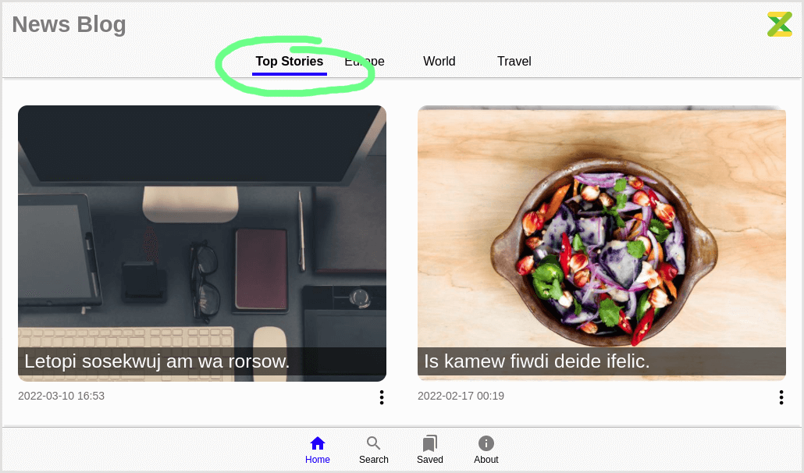
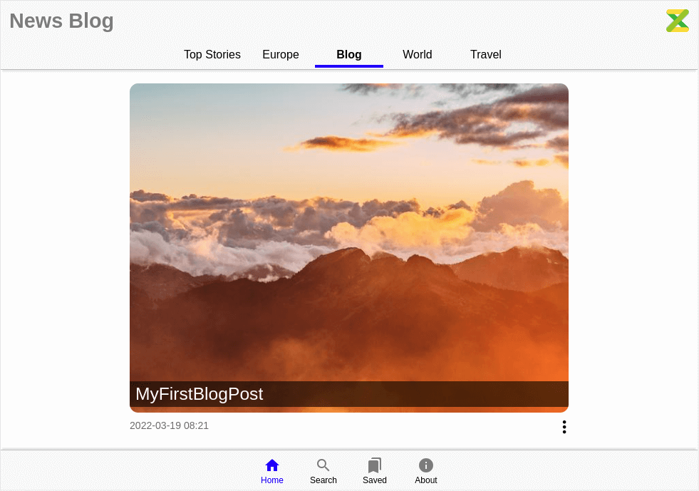

This template is based on `zuix-web-starer`. It is recommended to read its [documentation](https://zuixjs.github.io/zuix-web-starter)
to get started with *zuix.js* templates.

## Creating a new project

To create a new starter project using this template (*news-blog*), enter the following command:

```shell
npx zuix new my-webapp -t news-blog
```

the new project structure will be created in the folder *my-webapp*.

Change directory to the new project folder:

```shell
cd my-webapp
```

## Starting development server

The development server will listen by default on port `8080` and serve files from the build folder `./docs`.
It will also watch for file changes in the `./source` folder and build them as required, automatically refreshing the browser
page.

```shell
npx zuix start
```

Once started you can open the web browser and load the website using the access URLs given in the console output.

```shell
[Browsersync] Access URLs:
 -----------------------------------
    Local: http://localhost:8080
 External: http://192.168.1.50:8080
 -----------------------------------
[Browsersync] Serving files from: docs
[Browsersync] Watching files...
```

The main project folder is the `./source` folder, where all website files are located. In particular, the `./source/content` folder,
contains all pages' content, implemented as plaintext files using [**Markdown**](https://www.markdownguide.org/getting-started/) syntax.
All other structural and page layout bits will be compiled automatically by the site generator.


## Managing content

Included with this web starter you will also find demo pages that can be removed by manually *deleting* the
`./source/content/` folder, or using the `zuix` CLI:

```shell
npx zuix wipe-content
```


### Adding a new page

Pages are organized into sections. Each section can be accessed from the header bar in the home page.



Sections and pages can be easily added with the following command:

```shell
npx zuix add -s <section_name> -n <page_name> -fm "<field>: <value>"
```

Where the `-s` option is used to specify the name of the section under with the new page will be grouped, while the `-n`
option is used to specify the name of the page. Both name must be *file-name* friendly, the [kebab-case](https://en.wikipedia.org/wiki/Letter_case#Kebab_case)
convention is adopted here.  
The `-fm` option can be used to specify additional front-matter fields.  
For example, the following command will add a new page in a section called also enabling the code highlighter:

```shell
npx zuix add -s blog -n my-first-blog-post -fm "options: highlight"
```



The new page file will be `./source/content/blog/my-first-blog-post/index.md`, and the `blog` folder will be automatically created
if it doesn't exist. The `blog` folder will also have an `index.liquid` file that just contains front matter data of the section,
and that can be used to customize the title and the display order in the homepage.


## Components

This web-starter is a component based web application that takes advantages of [zuix.js](https://zuixjs.org) library, a very versatile and
fast library for creating components.

The following components are used:
- **Auto-hiding header**, to allow a full immersive experience while reading pages on small screens
- **Menu overlay**, that can be used to quickly navigate within a page content, and that auto hides when the page is scrolled
- **Scroll helper**, used in some of the above components to handle page scroll events, and that can eventually  
  be used to "watch" elements position and trigger events as they become visible on screen
- **Gesture detector**, used in various components to detect gestures
- **View Pager**, to implement horizontal scroll with snapping to switch from section to section
- **List View**, for rendering lists such as the search results and bookmarks

All the above components are part of [zKit](https://zuixjs.github.io/zkit/) library, a library of components built with *zuix.js*.  
To learn more about how to create and load components, see [zuix.js](https://zuixjs.org) website.


## Files structure in brief

Template engine folders:
```
./source/_data     # data folder
./source/_filters  # filters
./source/_inc      # includes and layouts
```

*zuix.js* components folders:
```
./source/app  # user-defined components specific to the app
./source/lib  # reusable component such as zKit components 
```

Global asset files and folders:
```
./source/images
./source/js
./browserconfig.xml
./favico.ico
./humans.txt
./manifest.json
```

Site search index and SEO:
```
./source/search-index.json.njk  # search-index builder script
./source/robots.njk
./source/sitemap.njk            # sitemap generator script
```

Main pages:
```
./source/index.liquid            # landing page
./source/ui/about/index.liquid   # about page
./source/ui/home/index.liquid    # home page
./source/ui/saved/index.liquid   # bookmarks page
./source/ui/search/index.liquid  # search page
```

Content pages:
```
./source/content
```

it's a good practice to have each content page implemented with its own folder and a `index.md` file in it.
In the same folder can be placed other sub-folders for page-local assets, such as images.


{{ good_mark }}

```
./source/content/travel/my-first-cruise/images/picture1.png
./source/content/travel/my-first-cruise/index.md
```

{{ bad_mark }}

```
./source/content/travel/my-first-cruise/images/picture1.png
./source/content/travel/my-first-cruise.md
```

{{ bad_mark }}

```
./source/content/travel/images/picture1.png
./source/content/travel/my-first-cruise.md
```
